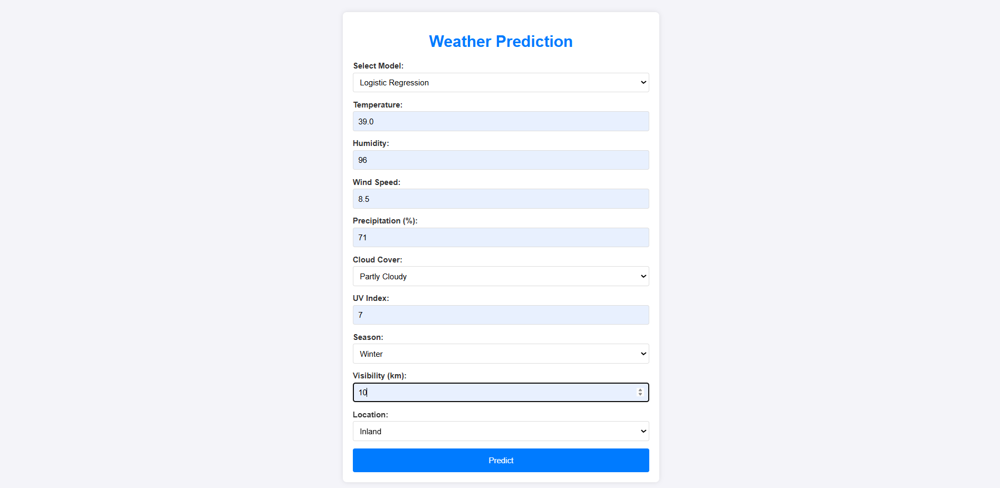
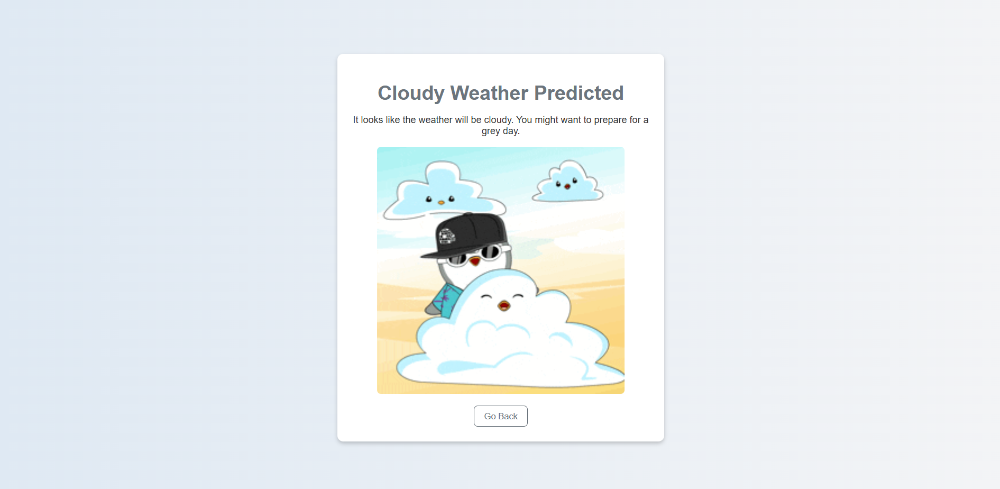

# 🌦️ Weather Type Classification WebApp


<p align="center">
  
  
  
</p>

## 🚀 Overview
A machine learning-powered web application for predicting weather types based on various atmospheric conditions. Built using Flask and multiple ML models, this app classifies weather into **Rainy ☔, Cloudy ☁️, Sunny ☀️, and Snowy ❄️**.

## 🏗️ Features
- ✅ Uses Logistic Regression, Decision Tree, Random Forest, SVM, and KNN models.
- ✅ Web-based interface built with Flask & HTML/CSS.
- ✅ User-friendly input form for weather parameters.
- ✅ Real-time predictions.
- ✅ Interactive UI with weather-themed pages.

## 🖼️ Screenshots
| Home Page | Prediction Output |
|-----------|------------------|
|  |  |

## 🛠️ Tech Stack
- **Frontend:** HTML, CSS, JavaScript
- **Backend:** Flask
- **Machine Learning:** Scikit-Learn, Joblib, Pandas, NumPy

## 📂 Folder Structure
```
📦 Weather-Type-Classification-WebApp
├── 📂 static        # CSS, JS, and images
├── 📂 templates     # HTML files (home, results pages)
├── models       # Saved ML models (joblib/pickle format)
├── app.py          # Flask application
├── requirements.txt # Dependencies
└── README.md       # Project documentation
```

## 🔧 Installation & Usage
### 1️⃣ Clone the Repository
```sh
git clone https://github.com/yourusername/Weather-Type-Classification-WebApp.git
cd Weather-Type-Classification-WebApp
```
### 2️⃣ Install Dependencies
```sh
pip install -r requirements.txt
```
### 3️⃣ Run the Application
```sh
python app.py
```
**Open the browser and go to:** `http://127.0.0.1:5000/`

## 🎯 How It Works
1. Enter weather-related inputs in the web form.
2. Click "Predict" to classify the weather type.
3. The app displays the predicted weather category.

## 🛠️ Model Training
- The dataset is preprocessed and split into training and testing sets.
- Different ML models are trained, and the best-performing model is selected.
- The selected model is saved using `joblib`.

## 🏆 Results & Accuracy
| Model | Accuracy |
|--------|----------|
| Logistic Regression | 85% |
| Decision Tree | 88% |
| Random Forest | 92% |
| SVM | 90% |
| KNN | 87% |

## 🤝 Contribution
Contributions are welcome! Please follow these steps:
1. Fork the repository.
2. Create a new branch.
3. Commit your changes.
4. Open a Pull Request.

## 📜 License
This project is licensed under the **MIT License**.

---
<p align="center">Made with ❤️ by <a href="https://github.com/JiteshShelke">Jitesh Shelke</a></p>

